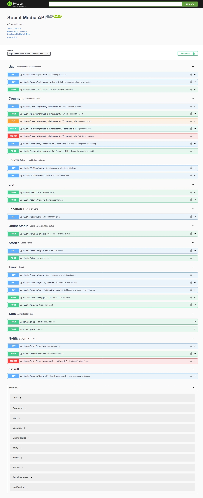

# Back-end

## Swagger

-   URL: /api/swagger
-   [Production](https://redux-social-media-backend.vercel.app/api/swagger/)
-   [Local](localhost:8080/api/swagger/)
-   Demo
    

# Front-end

-   [Production](https://redux-social-media-front-end.vercel.app/)
